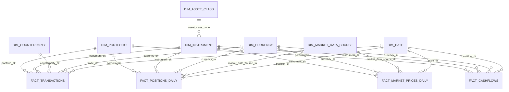

# Quant Core Business Data Model Guide

## Purpose

This document explains the `Quant Core` data model from a business and financial analytics perspective.

It is intended to answer four questions:
- what data we store
- how the tables relate to each other
- why each dataset matters for the business
- how data flows from raw landing files to Gold analytics outputs

This note is written for business stakeholders, analysts, architects, and engineers who need a common understanding of the platform.

## Why the data model matters

In a financial analytics platform, calculations such as `VaR`, `SVaR`, `IRR`, `XIRR`, and `CAGR` are only as reliable as the underlying data model.

A strong data model is important because it:
- creates a single version of truth for portfolios, instruments, prices, transactions, and cashflows
- ensures risk and performance calculations are based on governed and traceable data
- supports auditability and regulatory-style traceability
- enables repeatable analytics across portfolios and time periods
- separates raw operational data from curated business data and final reporting outputs

From a business point of view, the platform is not just storing data. It is turning fragmented financial events into trusted measures of:
- exposure
- market movement
- portfolio value
- return
- risk

## Business objective of Quant Core

The business objective of `Quant Core` is to provide an enterprise-ready financial calculation platform in Databricks that can:
- ingest portfolio and market data from upstream sources
- standardize and govern that data
- enrich the data into finance-ready facts and dimensions
- produce trusted outputs for risk and performance analysis

In this POC, the business questions we want to answer include:
- what positions does a portfolio hold on a given day
- what was the market value of those holdings
- how did historical market movements affect portfolio risk
- what is the portfolio `VaR` and `SVaR`
- what returns did the portfolio generate over time
- what are the `IRR`, `XIRR`, and `CAGR` measures for the portfolio

## High-level model overview

The model is built around:
- dimension tables, which describe business entities
- fact tables, which capture measurable business events and balances

This is important because financial analytics works best when:
- descriptive context is separated from measurable activity
- calculations can join facts to conformed dimensions
- the same portfolio, instrument, currency, and date definitions are reused consistently

## Dimension tables and business meaning

### `dim_portfolio`

Business meaning:
- defines the investment portfolio being analyzed

Why it matters:
- portfolios are the primary business entity for both risk and return reporting
- all downstream analytics are grouped, filtered, and compared at portfolio level

Typical business attributes:
- portfolio identifier
- portfolio name
- portfolio type
- base currency
- risk policy

Typical business questions answered:
- which portfolio does this transaction belong to
- what is the reporting currency for this portfolio
- which portfolios follow which risk policies

### `dim_instrument`

Business meaning:
- defines the financial instrument held or traded by the portfolio

Why it matters:
- instruments are the core building blocks of holdings, market value, returns, and risk
- market prices and positions cannot be analyzed correctly without a governed instrument master

Typical business attributes:
- instrument identifier
- instrument name
- ticker
- ISIN
- asset class
- currency
- issuer
- maturity date
- coupon rate

Typical business questions answered:
- what type of asset is the portfolio exposed to
- which instruments belong to a particular asset class
- which holdings are bonds versus equities versus ETFs

### `dim_counterparty`

Business meaning:
- defines the broker, bank, custodian, or external institution involved in a transaction

Why it matters:
- helps trace transactional activity and potential exposure by external party
- supports operational and control reporting

Typical business questions answered:
- which counterparty executed a trade
- how much activity is routed through a given broker or bank

### `dim_currency`

Business meaning:
- defines supported currencies

Why it matters:
- financial calculations depend heavily on currency context
- portfolio valuation and reporting must be currency-aware

Typical business questions answered:
- what currency was the transaction executed in
- what currency is the instrument priced in
- what is the portfolio base currency

### `dim_asset_class`

Business meaning:
- classifies instruments into business categories such as equity, bond, ETF, mutual fund, or derivative

Why it matters:
- risk and performance are often analyzed by asset class
- helps aggregate exposures and explain portfolio composition

Typical business questions answered:
- how much market value is held in bonds versus equities
- which asset classes contribute most to risk

### `dim_market_data_source`

Business meaning:
- identifies the vendor or source system that provided the market data

Why it matters:
- pricing and return calculations require source traceability
- supports governance and operational validation

Typical business questions answered:
- which source provided the price for this instrument
- can two calculations be compared if they rely on different price sources

### `dim_date`

Business meaning:
- standard calendar dimension used to analyze facts by day, month, quarter, and year

Why it matters:
- financial reporting is time-driven
- enables consistent daily, monthly, quarterly, and yearly analysis

Typical business questions answered:
- what was the month-end position
- what is the quarter-to-date return
- which dates are business days

## Fact tables and business meaning

### `fact_transactions`

Business meaning:
- captures trade activity such as buys and sells

Why it matters:
- transactions explain how a portfolio changes over time
- they are the operational events that drive changes in holdings and exposure

Typical measures:
- quantity
- price
- gross amount
- fees
- net amount

Business value:
- supports trade analysis
- helps reconcile position movement
- provides evidence for portfolio activity and execution history

### `fact_positions_daily`

Business meaning:
- captures the portfolio’s end-of-day holdings by instrument

Why it matters:
- this is one of the most important facts for risk and valuation
- `VaR` and many portfolio exposures are derived from daily positions

Typical measures:
- quantity
- end-of-day price
- market value
- unrealized PnL

Business value:
- supports exposure reporting
- supports market value reporting
- provides the position base for risk simulation

### `fact_market_prices_daily`

Business meaning:
- stores daily market prices and returns for instruments

Why it matters:
- without market prices, there is no portfolio valuation
- without returns, historical simulation for `VaR` and `SVaR` cannot be performed

Typical measures:
- close price
- return percentage
- volatility proxy

Business value:
- supports revaluation of holdings
- supports daily return analysis
- drives risk simulations

### `fact_cashflows`

Business meaning:
- stores dated cash inflows and outflows for portfolio performance analysis

Why it matters:
- `IRR` and `XIRR` depend on correctly dated cashflows
- cashflows represent the economic reality of investments and distributions

Typical measures:
- cashflow amount
- cashflow type
- cashflow date

Business value:
- supports money-weighted return calculations
- helps distinguish performance from simple market value movement

## Relationship between the tables

The model follows a star-style analytical design.

Core business relationships:
- one portfolio can have many transactions
- one portfolio can have many daily positions
- one portfolio can have many cashflows
- one instrument can appear in many transactions
- one instrument can appear in many positions
- one instrument can have many daily market prices
- one counterparty can be linked to many transactions
- one currency can be reused across transactions, positions, prices, and cashflows
- one market data source can provide prices for many instruments
- one asset class can classify many instruments

This structure matters because it allows us to answer analytical questions at different levels:
- by portfolio
- by instrument
- by asset class
- by currency
- by counterparty
- by date

## Relationship view

## Why the relationships are important to the business

These relationships are not only technical joins. They represent business meaning.

Examples:
- `portfolio + position + price` tells us current exposure and market value
- `portfolio + position + historical returns` tells us simulated portfolio loss and `VaR`
- `portfolio + cashflows + valuation dates` tells us `IRR`, `XIRR`, and `CAGR`
- `instrument + asset class` tells us concentration and risk composition
- `transaction + counterparty` tells us who executed business activity

Without these relationships:
- market values cannot be trusted
- positions cannot be explained
- returns cannot be calculated accurately
- risk outputs cannot be reconciled back to business entities

## Data flow from raw to Gold

The platform uses Medallion architecture because finance data should become more trusted and business-ready at each stage.

### 1. Raw landing in Volumes

Business purpose:
- receive source data in its delivered form
- preserve a traceable handoff from source to platform

In this POC:
- source files are generated as mock data
- fact files are organized under `dataset/YYYYMM/`
- daily files represent business-day delivery units

Business value:
- gives us a controlled landing zone
- supports monthly replay and audit
- separates file delivery from business curation

### 2. Bronze layer

Business purpose:
- capture the raw delivered data with lineage and ingestion metadata

What happens here:
- files are read as landed
- source file metadata is captured
- ingestion timestamps and load identifiers are added
- raw content is preserved before business correction

Business value:
- creates an audit trail
- allows us to trace Gold numbers back to the files that created them
- supports operational troubleshooting and reruns

### 3. Silver layer

Business purpose:
- turn raw data into conformed, validated, finance-ready data

What happens here:
- raw columns are standardized
- data types are corrected
- dimensions are conformed
- facts are enriched with keys and business context
- bi-temporal fields preserve valid time and system time

Business value:
- creates trusted business entities
- ensures calculations use consistent definitions
- supports late corrections without losing history
- becomes the analytical foundation for all downstream models

This is the most important layer for business trust because:
- bad Silver means bad Gold
- unmanaged raw data should not be used directly for executive or risk reporting

### 4. Gold layer

Business purpose:
- publish business-consumable analytics outputs

What happens here:
- risk results are calculated
- performance results are calculated
- summary views are created for dashboards and review

Gold outputs in this POC include:
- `risk_var_results`
- `risk_svar_results`
- `risk_pnl_distribution`
- `performance_irr_results`
- `performance_xirr_results`
- `performance_cagr_results`

Business value:
- turns governed data into decision-support metrics
- supports portfolio monitoring and investment review
- provides analytics that can be consumed by business users, reporting teams, and future dashboards

## Why Medallion architecture is useful for the business

From a business perspective, Medallion architecture is important because it separates concerns:

- Raw is for traceability
- Bronze is for audit-ready capture
- Silver is for trusted business data
- Gold is for decision-making and reporting

This reduces risk in financial reporting because:
- the same raw files are not reused differently by multiple teams
- business rules are applied in one curated layer
- final outputs can be explained and reconciled

In finance, that matters because stakeholders need to trust not only the number, but also how the number was produced.

## Why bi-temporal design is important to the business

Financial data changes in two ways:
- something becomes true in the business on a certain effective date
- the platform may learn about that change later

Bi-temporal design helps answer both:
- what was true on the business date
- what did the platform know at a given point in time

Business value:
- supports audit and backtesting
- supports restatements and late-arriving corrections
- improves confidence in historical analysis
- helps explain why a number may have changed after a correction

This is especially important for enterprise financial systems because business users often ask:
- what was our exposure on that date
- what did we report at that time
- why is the current answer different from the previously reported answer

## How this supports the target calculations

### `VaR`

Needs:
- portfolio positions
- instrument market values
- historical market returns

Business purpose:
- estimate potential portfolio loss under normal market conditions

### `SVaR`

Needs:
- the same inputs as `VaR`
- a stressed historical period

Business purpose:
- estimate potential portfolio loss under stressed market conditions

### `IRR`

Needs:
- periodic cashflows

Business purpose:
- measure money-weighted return under regular intervals

### `XIRR`

Needs:
- dated irregular cashflows

Business purpose:
- measure realistic money-weighted return for irregular investment events

### `CAGR`

Needs:
- beginning value
- ending value
- time period

Business purpose:
- measure normalized annual growth over time

## Executive summary

The `Quant Core` data model is important because it creates a governed financial foundation for both risk and performance analytics.

Its value to the business is that it:
- organizes financial data into clear business entities and measurable facts
- preserves traceability from raw files to executive analytics
- supports repeatable and explainable calculations
- enables future enterprise scaling in Databricks

In simple terms:
- dimensions tell us what the business entities are
- facts tell us what happened and what the values were
- Medallion architecture tells us how raw data becomes trusted analytics
- Gold outputs tell the business what the portfolio risk and return actually are
